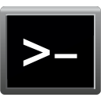
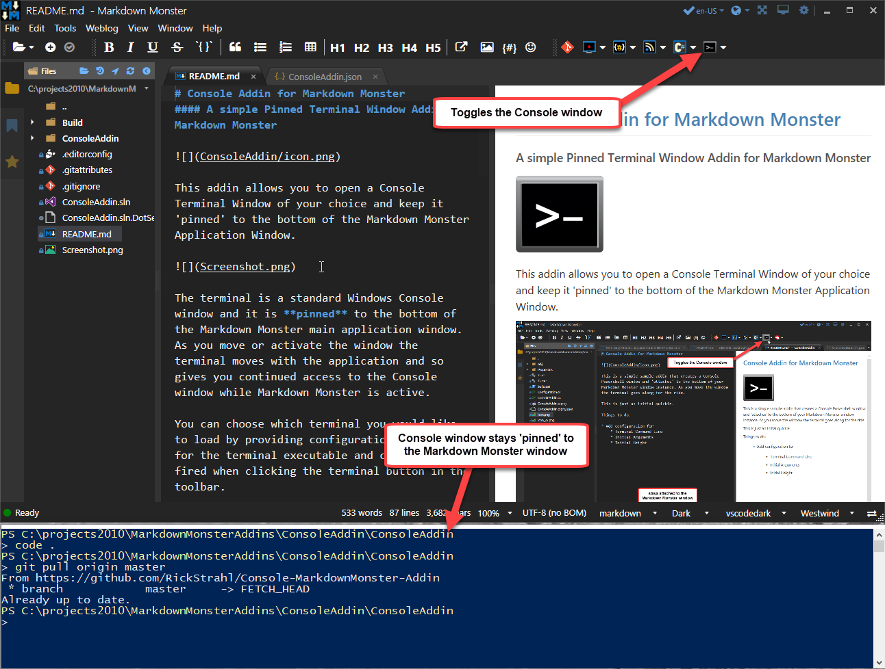

# Console Addin for Markdown Monster
#### A simple Pinned Terminal Window Addin for Markdown Monster



This addin allows you to open a Console Terminal Window of your choice and keep it 'pinned' to the bottom of the Markdown Monster Application Window.



The terminal is a standard Windows Console window and it is **pinned** to the bottom of the Markdown Monster main application window. As you move or activate the window the terminal moves with the application and so gives you continued access to the Console window while Markdown Monster is active.

You can choose which terminal you would like to load by providing configuration settings for the terminal executable and command line fired when clicking the terminal button in the toolbar.

You can use the Console toolbar button to toggle the Console window on and off. The opened Console is also automatically closed when you shut down Markdown Monster.

## Console Configuration
The console has a few configuration options which you can access by clicking the drop down button next to the Console icon in the toolbar and choosing **Configure Console**.

The default configuration looks like this:

```json
{
  "InitialHeight": 300,
  "StripWindowHeader": true,
  "TerminalExecutable": "powershell.exe",
  "TerminalArguments": "-noexit -command \"cd '{0}'\""
}
```

### Configuration Values
The configuration lets you configure a few simple settings:

#### Initial Height
Specifies the initial height of the pinned Console window in pixels.

#### StripWindowHeader
If `true` removes the Window header from the Console window. This wastes a little less screen real estate as the top Windows window Chrome is removed. 

If you'd rather see the standard Windows header, set this value to `false`.

#### Terminal Executable and TerminalArguments
Lets you specify the executable and command line arguments to start a new terminal session in the Console Window.

### Console Examples
The following are configuration settings for several different consoles. Note that you can use `{0}` as the placeholder to the path of the current document. If not document is open this value will be blank or you can remove the `{0}` from the arguments to not inject the path.

#### Powershell
This is the default configuration that starts up Powershell in the active document's folder.

```json
{
  "InitialHeight": 300,
  "StripWindowHeader": true,
  "TerminalExecutable": "powershell.exe",
  "TerminalArguments": "-noexit -command \"cd '{0}'\""
}
```

#### Windows Command Prompt
The following starts a classic Windows Command Prompt in the folder of the active document.

```json
{
  "InitialHeight": 300,
  "StripWindowHeader": true,
  "TerminalExecutable": "cmd.exe",
  "TerminalArguments": "cmd /K \"cd {0}\""
}
```
  
#### ConEmu
The following sets up the popular ConEmu Console application by opening in the current document's path with the `{Powershell}` subconsole configuration. You can change the configuration to any of your installed consoles or leave it out for the default console.

```json
{
  "InitialHeight": 350,
  "StripWindowHeader": false,
  "TerminalExecutable": "C:\\Program Files\\ConEmu\\ConEmu64.exe",
  "TerminalArguments": "/dir \"{0}\" /cmd {Powershell}"
}
```

> ConEmu uses a multi-window layout, so there's no easy way to kill console instances. It's best to explicitly close instances when you are done with them rather than closing through the Console Addin toggle button.

